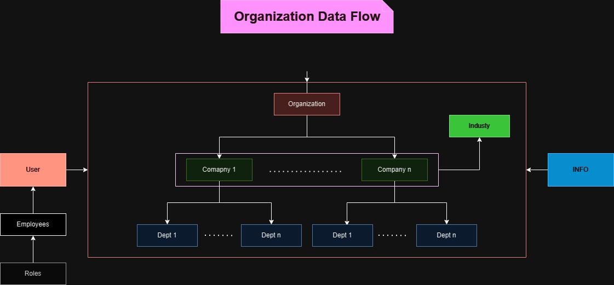

# EMT(Organization Management Tool)

## About Project

-   This is an backend for api project i have started on working omt stands for organization management. This project includes basic operation for oraganization hierarchy management, employee management, role and access control for starter.

### Schema Design

### Organization flow

